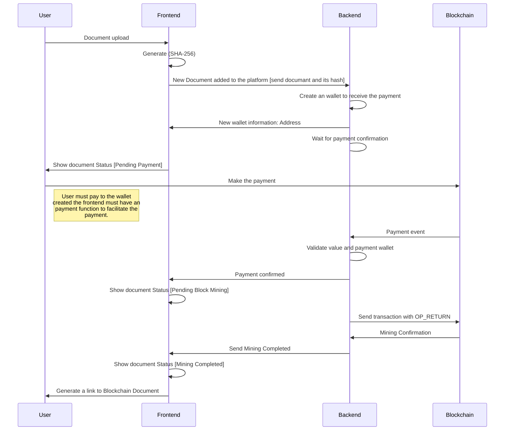

# Shi(し) Satoshi - Backend - Challenge 3

## Description:

This is the backend for the Bitcoin Document registry project. It allows users to register documents by generating a SHA-256 hash, creating a Bitcoin wallet, and embedding the hash in a Bitcoin transaction using the OP_RETURN field.

## Project Scope



## **Technologies Used**

-   **Python** (FastAPI)
-   **Bitcoin Regtest** (via `bitcoinrpc`)
-   **SQLite** (for database storage)

---

## **Setup**

### **1. Prerequisites**

-   Python 3.8+
-   Bitcoin Core running in Regtest mode
-   SQLite (included with Python)

### **2. Install Dependencies**

Run the following command to install the required dependencies:

    pip install fastapi uvicorn python-bitcoinrpc python-dotenv

### **3. Configure Bitcoin Regtest**

Ensure Bitcoin Core is running in Regtest mode with RPC enabled. Update the `.env` file with your RPC credentials:

    DATABASE_URL=sqlite:///./bitcoin_challenge.db
    BITCOIN_RPC_USER=your_rpc_user
    BITCOIN_RPC_PASSWORD=your_rpc_password
    BITCOIN_RPC_HOST=localhost
    BITCOIN_RPC_PORT=18443

### **4. Run the Backend**

Start the FastAPI server:

    uvicorn app.main:app --reload

The backend will be available at `http://127.0.0.1:8000`.

---

## **API Endpoints**

### **1. POST /upload**

Upload a document and generate a Bitcoin wallet.

**Request:**

    curl -X POST "http://127.0.0.1:8000/upload" \
    -H "Content-Type: application/json" \
    -d '{"document": "This is a test document"}'

**Response:**

    {
      "address": "mktest1234567890abcdef",
      "hash": "e3b0c44298fc1c149afbf4c8996fb92427ae41e4649b934ca495991b7852b855"
    }

---

### **2. POST /payment-confirmation**

Confirm payment to the wallet address.

**Request:**

    curl -X POST "http://127.0.0.1:8000/payment-confirmation" \
    -H "Content-Type: application/json" \
    -d '{"document_hash": "e3b0c44298fc1c149afbf4c8996fb92427ae41e4649b934ca495991b7852b855"}'

**Response:**

    {
      "status": "Payment Confirmed"
    }

---

### **3. POST /send-transaction**

Send a transaction with the document hash in the `OP_RETURN` field.

**Request:**

    curl -X POST "http://127.0.0.1:8000/send-transaction" \
    -H "Content-Type: application/json" \
    -d '{"document_hash": "e3b0c44298fc1c149afbf4c8996fb92427ae41e4649b934ca495991b7852b855"}'

**Response:**

    {
      "status": "Mining Completed",
      "tx_id": "abc123def456ghi789"
    }

---

## **Testing with Curl**

### **1. Upload a Document**

    curl -X POST "http://127.0.0.1:8000/upload" \
    -H "Content-Type: application/json" \
    -d '{"document": "This is a test document"}'

### **2. Confirm Payment**

Make a payment to the generated wallet address using Bitcoin Core CLI:

    bitcoin-cli -regtest sendtoaddress <wallet_address> 0.0001

Then, confirm the payment:

    curl -X POST "http://127.0.0.1:8000/payment-confirmation" \
    -H "Content-Type: application/json" \
    -d '{"document_hash": "<document_hash>"}'

### **3. Send OP_RETURN Transaction**

    curl -X POST "http://127.0.0.1:8000/send-transaction" \
    -H "Content-Type: application/json" \
    -d '{"document_hash": "<document_hash>"}'

---

## **Database Schema**

The SQLite database contains two tables:

1.  **documents**:

    -   `id`: Primary key
    -   `document_hash`: SHA-256 hash of the document
    -   `wallet_address`: Bitcoin wallet address
    -   `status`: Document status (Pending Payment, Pending Block Mining, Mining Completed)
    -   `tx_id`: Transaction ID (after mining)

2.  **wallets**:

    -   `id`: Primary key
    -   `private_key`: Wallet private key
    -   `address`: Wallet address
    -   `document_hash`: Foreign key to the `documents` table

---

## **Deployment**

To deploy the backend:

1.  Use a production-ready server like **Gunicorn**:

```
    gunicorn -w 4 -k uvicorn.workers.UvicornWorker app.main:app
```

2.  Deploy to a cloud provider.

---

## **Contributing**

Feel free to open issues or submit pull requests for improvements.

---

## **License**

This project is licensed under the MIT License. See the [LICENSE](https://chat.deepseek.com/a/chat/s/LICENSE) file for details.
